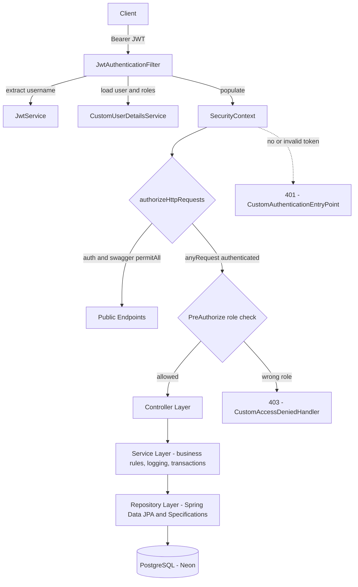
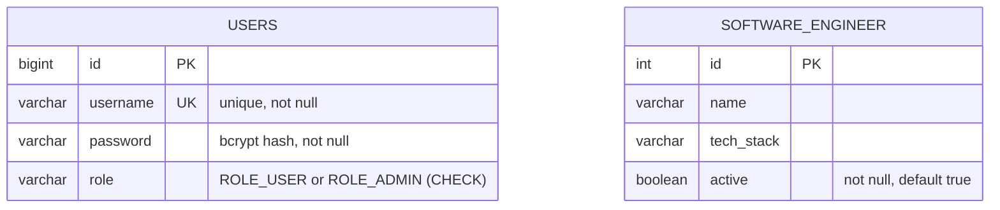
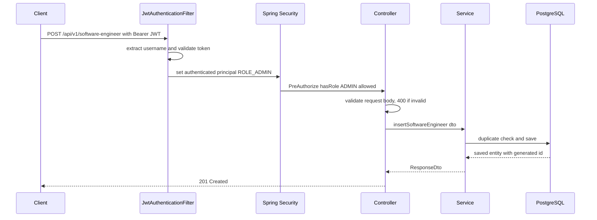

# 🔐 Secure Engineer Management API

A secure, production-structured RESTful backend built with **Spring Boot 3** and **Java 21**, showcasing **JWT authentication**, **role-based access control (RBAC)**, dynamic filtering, pagination, centralized error handling, and **cloud deployment on Render + Neon PostgreSQL**.

> This project is deliberately built as a **security-first backend** — the CRUD is just the vehicle. The real focus is a hand-wired Spring Security filter chain, method-level authorization, and a test suite that proves the access rules.

---

## 🌐 Live Deployment

| | |
|---|---|
| 🔗 **Live API** | https://secure-engineer-management-api.onrender.com |
| 📘 **Swagger UI** | https://secure-engineer-management-api.onrender.com/swagger-ui/index.html |

> 💡 Hosted on Render's free tier — the first request may take **~30 seconds** to wake the instance.

---

## 🚀 Tech Stack

| Layer | Technology |
|---|---|
| Language | Java 21 |
| Framework | Spring Boot 3.3.5 |
| Security | Spring Security (JWT + RBAC), BCrypt |
| Persistence | Spring Data JPA (Hibernate) |
| Database | PostgreSQL — Neon (cloud) / Docker (local) / H2 (tests) |
| JWT | `io.jsonwebtoken` (jjwt) 0.11.5, HS256 |
| Validation | Jakarta Bean Validation |
| Docs | OpenAPI / Swagger (springdoc) |
| Deployment | Docker on Render |
| Build | Maven |

---

## 🏗️ Architecture

Clean, layered architecture with a dedicated security layer in front of the controllers.



**Responsibilities**

| Layer | Responsibility |
|---|---|
| Security | JWT parsing, authentication, role validation, 401/403 handling |
| Controller | HTTP mapping, status codes, `@PreAuthorize` |
| Service | Business logic, validation rules, transactions, structured logging |
| Repository | Data access via JPA + dynamic `Specification` queries |
| Exception | Centralized error → HTTP mapping via `@RestControllerAdvice` |

---

## 🔐 Security Implementation

- **Stateless JWT authentication** (no server-side sessions)
- **Role-Based Access Control** — `ROLE_USER` (read) vs `ROLE_ADMIN` (read + write)
- **Method-level security** with `@PreAuthorize`
- **Custom `AuthenticationEntryPoint`** → clean JSON `401 Unauthorized`
- **Custom `AccessDeniedHandler`** → clean JSON `403 Forbidden`
- **BCrypt** password hashing
- Custom `OncePerRequestFilter` registered **before** `UsernamePasswordAuthenticationFilter`

---

## 📊 Core Features

- Full CRUD on software engineers
- Pagination & sorting (default: `page=0`, `size=5`, `sort=id,asc`)
- Dynamic filtering via Spring Data **Specifications**
  - `name` → partial, case-insensitive match
  - `techStack` → exact, case-insensitive match
- **DTO-based** request/response (entities never exposed)
- Custom `PaginatedResponse<T>` envelope for a stable API contract
- Centralized exception handling
- Structured logging (INFO / WARN / DEBUG)
- Correct HTTP status codes (400 / 401 / 403 / 404 / 409)

---

## 📡 API Endpoints

| Method | Endpoint | Access | Description |
|---|---|---|---|
| `POST` | `/auth/register` | Public | Register a new user |
| `POST` | `/auth/login` | Public | Authenticate → returns JWT |
| `GET` | `/api/v1/software-engineer` | USER, ADMIN | List (paginated + filterable) |
| `GET` | `/api/v1/software-engineer/{id}` | USER, ADMIN | Get by ID |
| `POST` | `/api/v1/software-engineer` | ADMIN | Create engineer |
| `PUT` | `/api/v1/software-engineer/{id}` | ADMIN | Update engineer |
| `DELETE` | `/api/v1/software-engineer/{id}` | ADMIN | Delete engineer |

**Filtering & pagination examples**

```http
GET /api/v1/software-engineer?name=an&techStack=java
GET /api/v1/software-engineer?page=0&size=5&sort=id,desc
```

---

## 🗄️ Database Design

Two independent tables — `users` handles **identity/auth**, `software_engineer` is the **managed resource**. There is intentionally **no foreign-key relationship** between them.



---

## 🔄 Request Lifecycle (Authenticated Write)



---

## 🧪 How to Test (Live)

1. Open **Swagger UI**
2. Register a user → `POST /auth/register`
3. Login → `POST /auth/login` and copy the JWT
4. Click **Authorize** in Swagger and paste:
   ```
   Bearer <your_token>
   ```
5. Call the secured endpoints

---

## ✅ Security Testing Matrix

| Scenario | Expected Status |
|---|---|
| No token | `401` |
| Invalid / expired token | `401` |
| USER → GET | `200` |
| USER → POST | `403` |
| ADMIN → POST | `201` |
| Validation error | `400` |
| Duplicate resource | `409` |
| Not found | `404` |

> These scenarios are backed by an automated Spring Security integration test suite (`@SpringBootTest` + MockMvc), plus Mockito unit tests and `@WebMvcTest` controller slice tests.

---

## 🐳 Local Development (Docker + PostgreSQL)

Start a local PostgreSQL instance:

```bash
docker-compose up -d
```

Run the application:

```bash
./mvnw spring-boot:run
```

App runs at `http://localhost:8080` · Swagger at `http://localhost:8080/swagger-ui/index.html`.

---

## ⚙️ Configuration

Environment-driven configuration (externalize secrets — **do not commit real values**):

```properties
# .env.example
DATABASE_URL=jdbc:postgresql://<host>/<db>?sslmode=require
DATABASE_USERNAME=<username>
DATABASE_PASSWORD=<password>
JWT_SECRET=<long-random-secret>
JWT_EXPIRATION=3600000
```

- Production uses **Neon** (serverless PostgreSQL, SSL required)
- Local development uses **Dockerized PostgreSQL**
- Tests run on **H2 in-memory** under the `test` profile

---

## 🔮 Future Improvements

- Refresh token support + token revocation (logout)
- Externalized secret management + rotation
- Rate limiting on `/auth/login`
- Flyway migrations (replace `ddl-auto=update`)
- CI/CD pipeline
- Frontend integration

---

> Built as a **security-first, production-structured backend** — with the auth model, layered design, and automated authorization tests treated as first-class concerns rather than afterthoughts.
